# FSOCIETY-SERVICE-BOT

Description:

**FSOCIETY SERVICE BOT** - A multifunctional program for **STEAM** and **CS:GO**.
Let's go through the functionality. The software has 7 tabs + 8th information about the developers.

Download   **FSOCIETY SERVICE BOT [v1.2.0.0](https://github.com/despa1r1337/FSOCIETY-SERVICE-BOT/releases)**

## Accounts
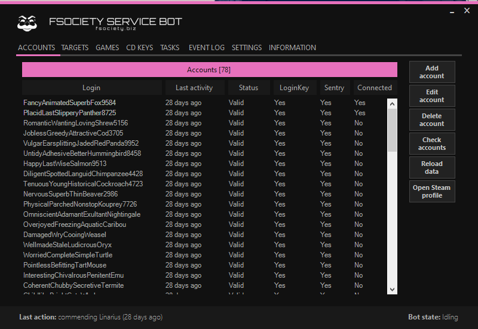
- Tab **Accounts** -
This tab is responsible for the GENERAL database of accounts in software. That is, first we add the accounts here, and then we distribute them according to the tasks (Reportbot / boost hours / commendbot, etc.)
Buttons:

**Add account** - Add an account to the database.

**Edit account** - Change the account in the database.

**Delete account** - Delete an account from the database.

**Check accounts** - Check accounts for the validity of the username and password + create sentry (This is a file that stores all the necessary information about the account so that each time you do not enter the guard on the account) file.

**Reload data** - Reset account information (Retention, last connection, etc.)

**Open Steam Profile** - Open STEAM profile. Resolve by login.

## Targets
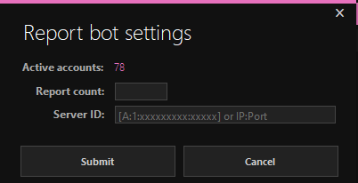

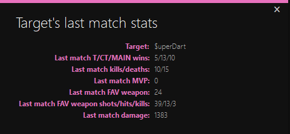

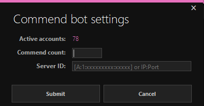

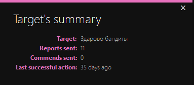
- Tab **Targets**
Here we have work with goals.
In the left tab, add accounts from a common database that will be used in this tab.

**Last Report Sent** - How much time has passed since the last ReportBot.

**Last Commend Sent** - How much time has passed since the last Commendbot.

Checkboxes:

**Account able to report** - You can report from this account.

**Account able to commend** - From this account you can send likes to your CS: GO profile.

Buttons:

**Add target** - Add target to reportbot / commendbot bot.

**Delete target**- Delete the target.

**Target's summary** - Get information on actions to do this. (The total number of submitted reports / likes in the CSGO profile | Last successful action)

**Get last match stats** - - Information about the last match of the player, so as not to check the demo (if the score is 50/7, then, of course, you can safely report) ( works if: the profile is not hidden, game activity is not hidden.)

**Open Steam Profile** - Open STEAM profile. Resolve by login.

**Refresh table data** - Update target data (Sometimes reports / likes / bans are not updated)

**START REPORT BOT** - Start a reportbot on the target.

**START COMMEND BOT** - Launch a commendbot on a target.

## Games
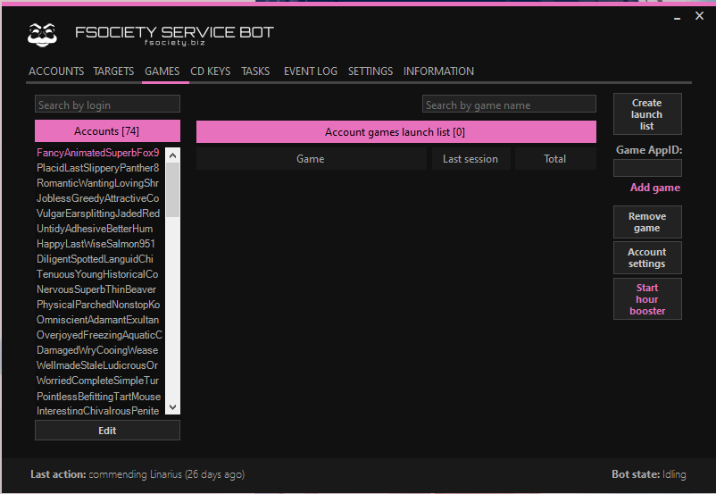

-Tab **Games" a.k.a "Hours Boost**-

This is our watch booster for different games. You can maximize 32 games at the same time.
In the left tab, add accounts from a common database that will be used in this tab.
Buttons:

**Create launch list** - Create a list of games that will be boosted on a specific account. Game IDs will be parsed from the games library of the account.

**Game AppID**: Add to the list the ID of the game that will be boosted. (Example with CS: GO: - From here, take only 730)

**Remove game** - Remove a game from the list of games.

**Start hour booster** - Run a boost clock on all accounts.

**Stop session account** - Stop boost hours on a specific account.

**Stop hours booster** - Disable boost hours on all accounts.

Account Settings:

 **Ignore this account** - Ignore the account (Pause) in the boost clock.

 **Show online status** - Show everyone in STEAM that the account is online.

 **Restart games every 3 hours** - Restart boost hours every 3 hours (For knocking out cards)

 **Show Custom non-steam game name** - Show in the STEAM profile that the account "is playing a third-party game% Here_custom_non-steam-game-name%"

 **The lower field requires no explanation.**

## CD Keys
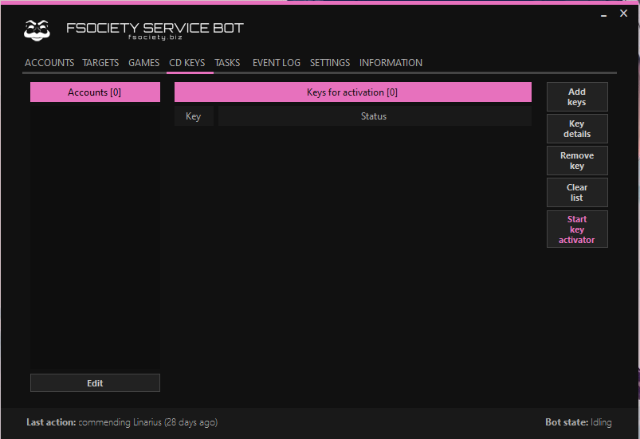

-**Cd Keys Tab** -
This is an activator of STEAM keys.
In the left tab, add accounts from a common database that will be used in this tab.
For each account you need to add your own keys.

Buttons:

**Add keys** - Add keys with STEAM games (1 key - 1 line)

**Key details** - Key details (Game name, activation status, key ID, key itself)

**Remove key** - Remove the key.

**Start key activator** - Start the key activator.

## Tasks
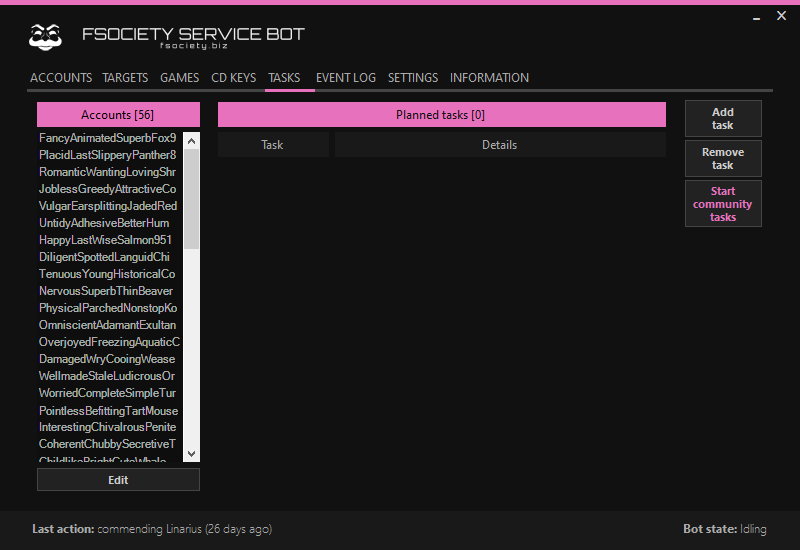

-**Tasks tab** -
Here are various tools that promote the STEAM profile / group.
In the left tab, add accounts from a common database, which (or for which) will be used in this tab.

Buttons:

**Add task - Add a task.**

 Task type:

 **Join group** - Win users in the STEAM group.

 **Group link** - Link to the group to which we will wind up.

 **Comment profile** - Cheat comments in the STEAM profile.

 **Profile ID** - custom URL or user ID, which we will twist.

 **Message** - The message that will be sent to the user in the comment.
 
 
 **Different** - 1 line = 1 message per 1 account.
 
 **Add to other accounts to** - Add a task to other accounts that you select below in "Select accounts"
 
 **Accounts** - The number of accounts used.
 
 **Select Accounts** - Select the accounts for this assignment.
 
 **Messages** - The type of messages sent (the same from all accounts or different).
 
 **Comment sharedfile** - Wrap comments on the illustration (take the ID from the illustration link, take the profileid from the user we will be twisting).
 
**Rate up sharedfile** - Launch likes on the illustration (take the ID from the illustration link, take the profileid from the user we will be twisting).

**Remove task** - Remove the task.

**START COMMUNITY TASKS** - Start STEAM tasks.

## Event Log
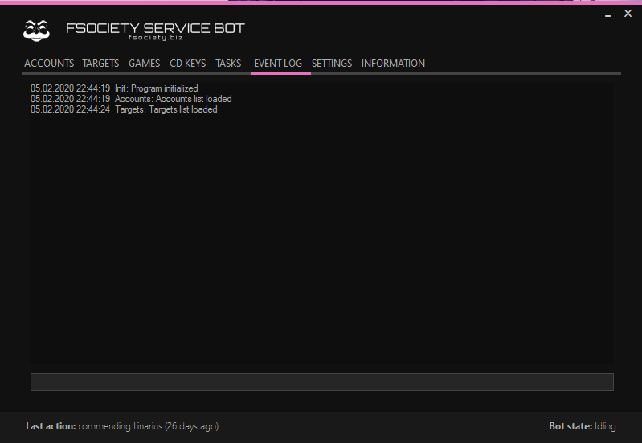

- Tab **Event Log** -

All actions and program errors will be displayed here.

## Settings
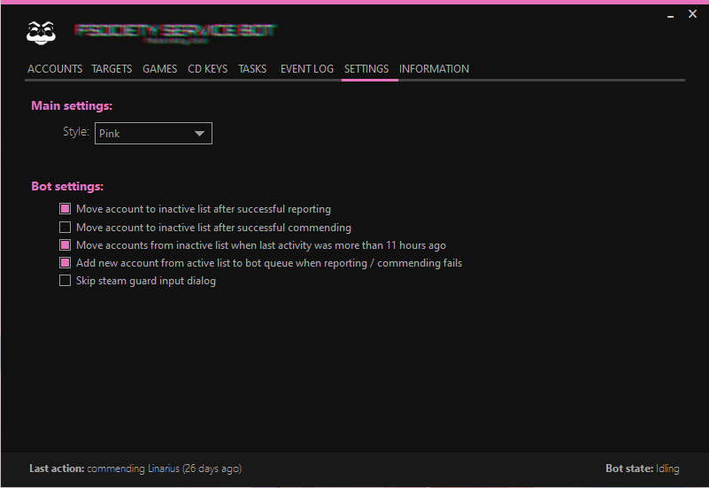

-Tab **Settings** -
Here is the program setting.

**Style** - Choose the color of the program.

Bot Settings:

**Move account to inactive list after successfull reporting** - Send an account for retirement (For working 8-12 hours) after a successfully submitted report (I advise you to leave it on).

**Move account to inactive list after successfull commending** - Send an account for retirement (For working 6-9 hours) after a successfully sent like to CS: GO profile (I advise you to remove the checkbox here).

**Move accounts from inactive list when last activity was more than 11 hours ago** - Allow accounts to complete tasks if more than 11 hours have passed (I advise you to enable it).

**Add new account from active list to bot queue when reporting / commending fails** - Replace the account in reporting / reporting if it, for example, was invalid or there were other errors.

## Information
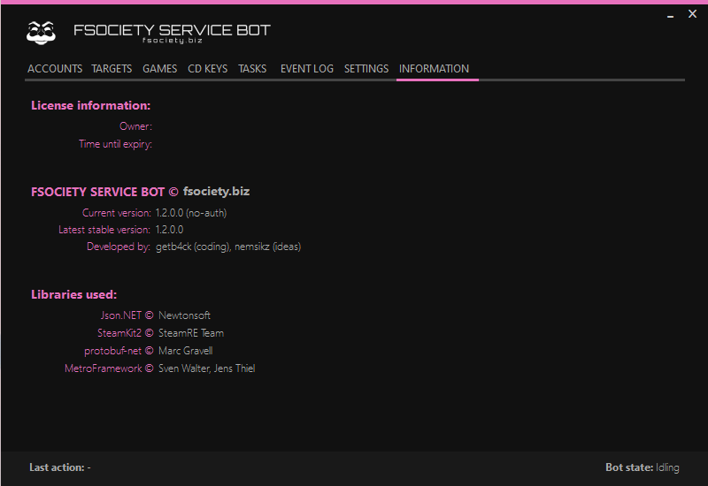

**program information** / **developers** / **libraries**

# Credits

@nemsikz  (ideas)

@getb4ck (coding)

